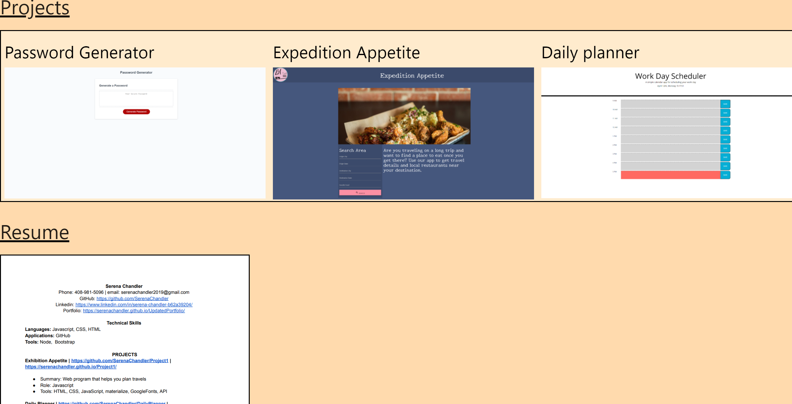
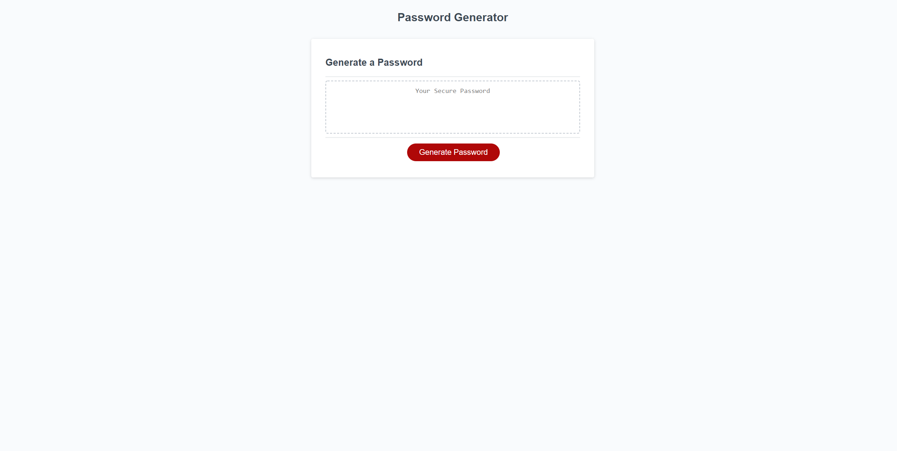
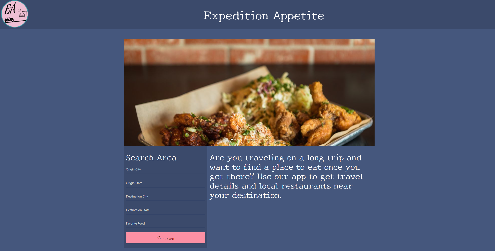
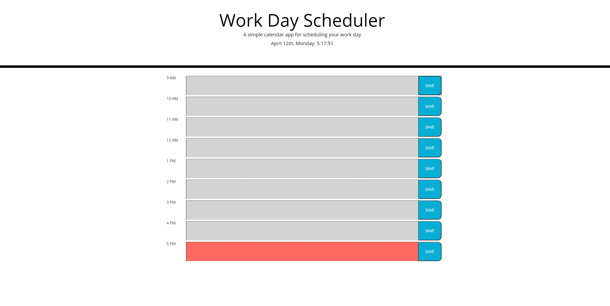

# UpdatedPortfolio

## summary of assignment
-this week we had to update our past portfolio, alongside our gitHub, linkedin, etc

## languages used
HTML with the matereilize framework was used to create most of the basic elements of the page
CSS was used to style individual page elements
JS was not used a wholoe lot, but was specifically used for the sidebar for the mobile navigation menu

## site preview




## code snippet (Adding links to past projects)
```
    <div>
        <h1 id="projects" class="section">Projects</h1>
        <div class="row box">
            <div class="col xl4">
                <a href="https://github.com/SerenaChandler/Password" target="_blank"><h2>Password Generator</h2></a> <a href="https://serenachandler.github.io/Password/" target="_blank">
                </a>
            </div>

            <div class="col xl4">
                <a href="https://github.com/SerenaChandler/Project1" target="_blank"><h2>Expedition Appetite</h2> </a><a href="https://serenachandler.github.io/Project1/" target="_blank">
                 </a>
            </div>
            
            <div class="col xl4">
                <a href="https://github.com/SerenaChandler/DailyPlanner" target="_blank"><h2>Daily planner</h2></a> <a href="https://serenachandler.github.io/DailyPlanner/" target="_blank">
                </a>
            </div>
        </div>
        
    </div>
```

## code snippet (making the navbar into a side bar in mobile)
```
HTML
    <nav>
        <div class="nav-wrapper">
          <a href="#" data-target="mobile-demo" class="sidenav-trigger"><i class="material-icons">menu</i></a>
          <ul id="nav-mobile" class="right hide-on-med-and-down">
            <li><a href="#about-me">About Me</a></li>
            <li><a href="#projects">Projects</a></li>
            <li><a href="#resume">Resume</a></li>
            <li><a href="#contact-me">Contact Me</a></li>
          </ul>
        </div>
    </nav>

    <ul class="sidenav" id="mobile-demo">
        <li><a href="#about-me">About Me</a></li>
        <li><a href="#projects">Projects</a></li>
        <li><a href="#resume">Resume</a></li>
        <li><a href="#contact-me">Contact Me</a></li>
    </ul>

Javascript
$(document).ready(function(){
    $('.sidenav').sidenav();
  });
```

## my links
[Github](https://github.com/SerenaChandler),
[Linkedin](https://www.linkedin.com/in/serena-chandler-b62a39204/),
[updated portfolio](https://serenachandler.github.io/DailyPlanner/)
      